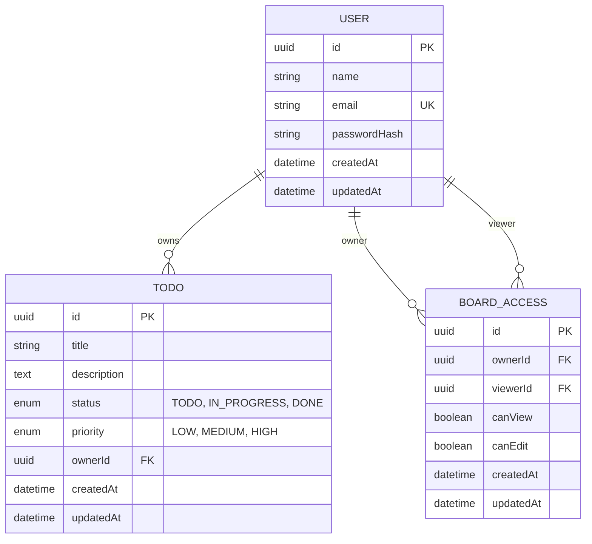

# Entity Relationship Diagram

This document describes the database entities used by the Todo/Kanban application. Users own Todo items arranged by status, and may grant other registered users view and/or edit access to their board.

## Entity Overview

The application defines three Sequelize models: `User`, `Todo`, and `BoardAccess`. Sequelize timestamps are enabled on all three tables, so each also has `createdAt` and `updatedAt` date/time fields.

### User (`users`)

**Purpose:** Stores each registered account and its authentication credentials.

| Field | Type | Null? | Details |
|---|---|---:|---|
| `id` | UUID | No | Primary key; defaults to a generated UUID. |
| `name` | String | No | User's display name. |
| `email` | String | No | Unique; Sequelize email-format validation is defined. |
| `passwordHash` | String | No | Hashed password value. |
| `createdAt` | Date/time | No | Sequelize-managed creation timestamp. |
| `updatedAt` | Date/time | No | Sequelize-managed last-update timestamp. |

- **Primary key:** `id`
- **Foreign keys:** None.
- **Important constraints:** `email` is unique and cannot be null. The model's email-format check is a Sequelize validation; it is not declared as a database `CHECK` constraint.
- **Enum/status fields:** None.

### Todo (`todos`)

**Purpose:** Stores a task on a user's board, including its Kanban status and priority.

| Field | Type | Null? | Details |
|---|---|---:|---|
| `id` | UUID | No | Primary key; defaults to a generated UUID. |
| `title` | String(255) | No | Required task title. |
| `description` | Text | Yes | Optional task description. |
| `status` | Enum | No | `TODO`, `IN_PROGRESS`, or `DONE`; defaults to `TODO`. |
| `priority` | Enum | No | `LOW`, `MEDIUM`, or `HIGH`; defaults to `MEDIUM`. |
| `ownerId` | UUID | No | Foreign key to `users.id`; deletes cascade from the user. |
| `createdAt` | Date/time | No | Sequelize-managed creation timestamp. |
| `updatedAt` | Date/time | No | Sequelize-managed last-update timestamp. |

- **Primary key:** `id`
- **Foreign keys:** `ownerId` references `users.id`.
- **Important constraints:** `title` is required; `description` may be null. There are indexes on `ownerId` and `status`. The model allows titles up to 255 characters; the current create/update API validation further limits them to 120 characters.
- **Enum/status fields:** `status` is `TODO`, `IN_PROGRESS`, or `DONE`. `priority` is `LOW`, `MEDIUM`, or `HIGH`.

### BoardAccess (`board_accesses`)

**Purpose:** Stores an access grant from a board owner to another user (the viewer), including view and edit flags.

| Field | Type | Null? | Details |
|---|---|---:|---|
| `id` | UUID | No | Primary key; defaults to a generated UUID. |
| `ownerId` | UUID | No | Foreign key to `users.id`, identifying the board owner; deletes cascade from that user. |
| `viewerId` | UUID | No | Foreign key to `users.id`, identifying the user receiving access; deletes cascade from that user. |
| `canView` | Boolean | No | Defaults to `true`. |
| `canEdit` | Boolean | No | Defaults to `false`. |
| `createdAt` | Date/time | No | Sequelize-managed creation timestamp. |
| `updatedAt` | Date/time | No | Sequelize-managed last-update timestamp. |

- **Primary key:** `id`
- **Foreign keys:** `ownerId` and `viewerId` both reference `users.id`.
- **Important constraints:** The (`ownerId`, `viewerId`) pair is unique, so a given viewer has at most one access record per owner. There is also an index on `viewerId`. The model does not declare a constraint forbidding an owner from being their own viewer; the access-grant API rejects self-sharing.
- **Enum/status fields:** None. Access is represented by the `canView` and `canEdit` booleans.

## Relationships

- One `User` can own many `Todo` records; each `Todo` belongs to exactly one owner.
- One `User` can grant access to many other users' accounts via `BoardAccess` records, as the `owner`.
- One `User` can receive many board access grants via `BoardAccess` records, as the `viewer`.
- Each `BoardAccess` record belongs to exactly one owner and exactly one viewer. The owner and viewer are both users; `BoardAccess` is the join entity that records the pair and their permissions.
- Deleting a user cascades to their owned todos and to access records where they appear as either owner or viewer.
- A user accesses their own board as its owner. Access to another user's board is controlled by a `BoardAccess` row with `canView` enabled. Editing another user's board additionally requires `canEdit` enabled (the API checks both flags). These flags govern API access; they are not separate entities or database roles.

## Mermaid ER Diagram

